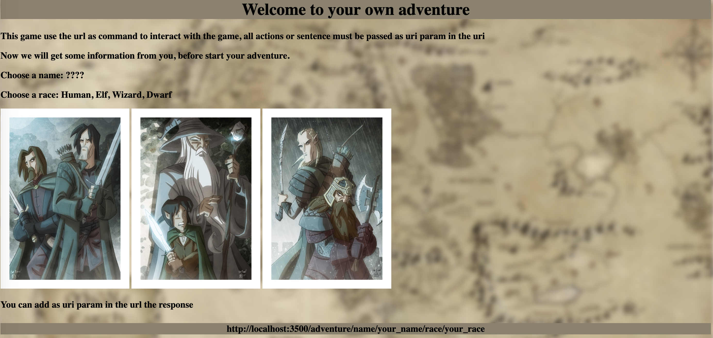
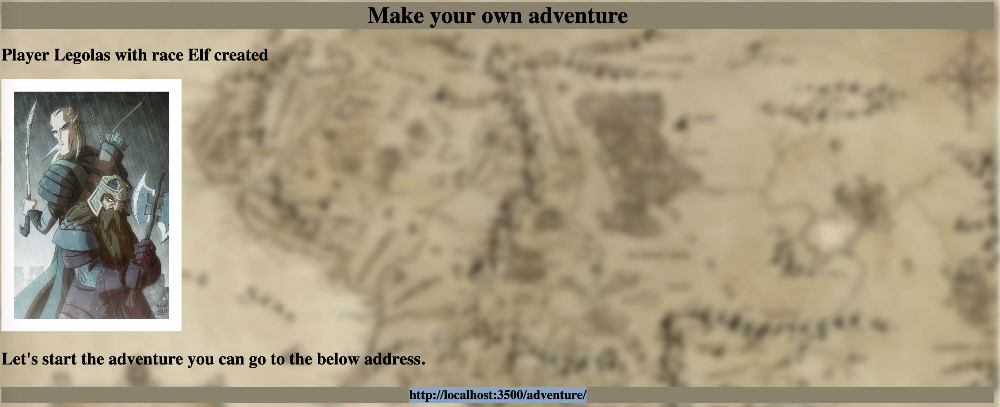
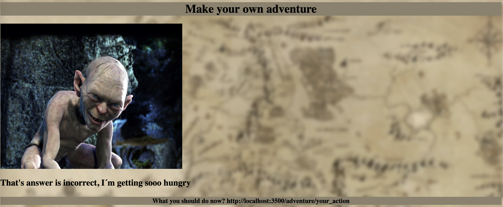

 

## Make your own adventure

It´s a game created purely in Haskell based on decision that you need to type in your browser.

The code of the game can be found [here](src/programs/adventure/Adventure.hs)

### How to Play

To play the game you will need to have [GHC](https://www.haskell.org/ghc/) installed

Then you just need to clone the whole project and run the main function of **Adventure** module

```
import Adventure

main :: IO ()
main = adventureServer
```

Then go to the url

```
http//localhost:3500/adventure/
```






