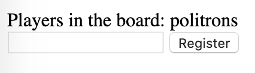
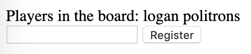

 

## Chess Online

A haskell online chess game to play with your browser through internet.

You can see the explanation and implementation of game [Here](Chess.hs)

### Use

* Run the game server program
    ```.haskell
    main :: IO ()
    main = chessServer
    ```

* Open your browser and register yourself in the input field
    ```
    http://localhost:3700/chess/players
    ```
    

* Ask the second player to also register to start playing

    

* To start making moves you just need to click in the piece that you want to move and click again in the destination


