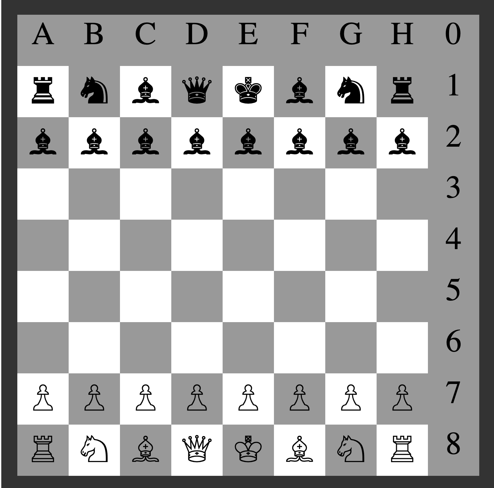

 

## Chess Online

A haskell online chess game to play with your browser through internet.

You can see the explanation and implementation of game [Here](Chess.hs)

### Use

* Run the game server program
    ```.haskell
    main :: IO ()
    main = chessServer
    ```

* Open your browser and register yourself
    ```
    http://localhost:3700/chess/register/politrons
    ```
* Ask the second player to also register to start playing

* To start making moves you just need to mark the coordinates with your alias register before **name** **from** and **to**

    ```
    http://localhost:3700/chess/politrons/d2/d3
    ```

